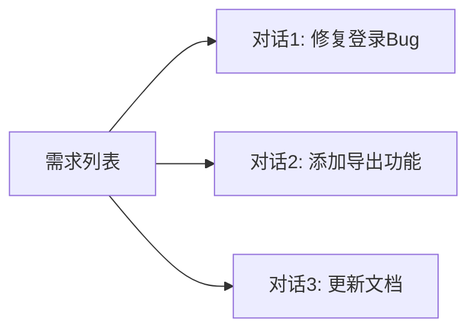

# 高手工作流

> 一个人顶全部角色 — 像专家一样用 AI 高效开发

## 核心理念

```
VS Code（编辑器）
  + Claude Code（AI 编程主力）
  + XNOW-Harness（辅助工具箱）
       └── 高手工作流（方法与纪律）
```

AI 上下文窗口有限（~200K），但项目代码是无限的。高手不是靠"把整个项目塞进一个对话"，而是把 AI 当成**流动的超级结对编程队友** — 每次对话只做一件事，做完就开新的，靠项目文档衔接上下文。

---

## 一、项目级 CLAUDE.md — 项目的"身份证"

每个项目根目录维护一份项目简介，让 AI 任何新对话都能一秒入戏：

### 模板

```markdown
# 项目名称

> 一句话描述

## 技术栈

- 前端: React 19 + Vite 8 + Antd 6
- 后端: Express + SQLite
- 部署: Docker + Nginx

## 目录结构

```
src/
├── pages/        ← 页面组件
├── components/   ← 通用组件
├── api/          ← API 调用
└── utils/        ← 工具函数
```

## 命令速查

| 命令 | 用途         |
|------|-------------|
| dev   | 启动开发服务器 |
| build | 构建生产版本  |
| test  | 运行测试      |

## 关键决策

- 为什么选这个方案
- 有什么约束（不要改什么）
- 当前进度（做到哪一步了）
```

### 位置

- 项目根目录的 `CLAUDE.md`（如果只有一个项目）
- 或 `.claude/PROJECT_SUMMARY.md`（如果项目在父目录下）

---

## 二、单任务单对话（One Issue, One Chat）

### 原则

| ✅ 正确做法 | ❌ 错误做法 |
|------------|------------|
| 一个对话只做一件事 | 在一个对话里修 Bug + 加功能 + 重构 |
| 做完一个功能点就提交 | 积攒十几个改动一起提交 |
| 上下文快满时主动换新对话 | 一个对话聊上百轮直到 AI 胡言乱语 |
| 新对话带上前一个对话的决策记录 | 开新对话让 AI 重新猜项目是什么 |

### 对话生命周期

```
开始新对话
  │
  ├── 告诉 AI 项目背景（项目 CLAUDE.md）
  ├── 告诉 AI 当前要做什么（单任务）
  │
  ▼
专注一个任务（修 Bug / 加功能 / 重构）
  │
  ├── 完成 → xnow sync → 更新项目进度 → 🆕 开新对话
  │
  └── 上下文快满 / 聊了太多轮 → 🚨 收尾 → 🆕 开新对话
```

### 信息传递链

```
对话1 (做功能A)
  → 完成 → xnow sync
  → 更新项目 CLAUDE.md 进度
  → 结束

对话2 (做功能B)
  → 读取项目 CLAUDE.md（秒懂项目）
  → 开干
  → 完成 → xnow sync
  → ...
```

---

## 三、XNOW 工作流全流程

### 日常开发

```bash
cd project-dir

# 1. xnow status         查看项目状态（可选）
# 2. Claude Code 写代码  AI 主力编程
# 3. xnow sync "提交信息"  完成一个功能点后提交
# 4. 重复 2-3
```

### 新项目启动

```bash
cd new-project-dir

# 1. xnow init           初始化 Git + 推送到 GitHub
# 2. 写项目 CLAUDE.md    项目"身份证"
# 3. Claude Code 开始开发
```

### 版本发布

```bash
# 累积了足够的功能点后
xnow release patch   # 小修小补
xnow release minor   # 新功能
xnow release major   # 重大更新
```

### 换电脑恢复

```bash
# 1. 安装基础环境（Git / Node / Python）
# 2. git pull 拉项目
# 3. 读项目 CLAUDE.md 了解进度
# 4. npm install 装依赖
# 5. 继续开发
```

---

## 四、AI 上下文管理

### 什么时候开新对话？

当出现以下信号时，说明该换新对话了：

- ☑️ 当前功能点已做完（最优时机）
- ☑️ 对话超过 15~20 轮
- ☑️ 感觉 AI 开始"忘记"前面的内容
- ☑️ 新任务和当前任务没有直接关系

### 开新对话前需要准备什么？

1. **提交当前代码** — `xnow sync`
2. **更新项目 CLAUDE.md** — 记录最新进度和关键决策
3. **新对话时粘贴项目 CLAUDE.md** 或告知 AI 读取它

### 同时做多个不相关任务



**不要**在一个对话里同时做 B + C + D。

---

## 五、xnow 命令速查

| 命令 | 用途 | 场景 |
|------|------|------|
| `xnow status` | 查看项目 git / 版本状态 | 日常 |
| `xnow sync "msg"` | 提交代码 + 推送 GitHub | 每完成一个功能点 |
| `xnow init` | 初始化项目 + GitHub 仓库 | 新项目 |
| `xnow release patch` | 打 tag + GitHub Release | 版本里程碑 |
| `xnow balance` | 查看 DeepSeek 余额 | 按需 |
| `xnow workflow` | 查看工作流状态指南 | 迷茫时 |

---

## 六、常见场景

### 场景 1：做一半发现任务太大了

```
原任务："做一个用户管理系统"
→ 拆成多个子任务：
  1. 注册功能
  2. 登录功能
  3. 用户列表
  4. 权限管理

每个子任务一个对话，做完一个 sync 一次。
```

### 场景 2：AI 开始胡言乱语

```
→ 停。开新对话。
→ 把项目 CLAUDE.md 给 AI
→ 告诉 AI "我要做 XXX，之前的进展是 YYY"
→ 继续
```

### 场景 3：同时多项目切换

```
→ 先 git status 确认当前项目没有未提交的修改
→ 切到另一个项目
→ 新对话，读那个项目的 CLAUDE.md
→ 继续
```

---

## 七、铁律

1. **不盲猜** — 先锁定根因再动手修
2. **不跳步** — 方案 → 计划 → 执行 → 审查 → 验证
3. **不擅作主张** — 改范围之前先问
4. **证据先于断言** — 完成之前必须有验证输出
5. **及时同步** — 每个功能点完成后提交推送
6. **简洁优先** — 最少代码解决问题
7. **精准修改** — 只改需求直接相关的代码
8. **停得下来** — 每个步骤有明确的停止条件
